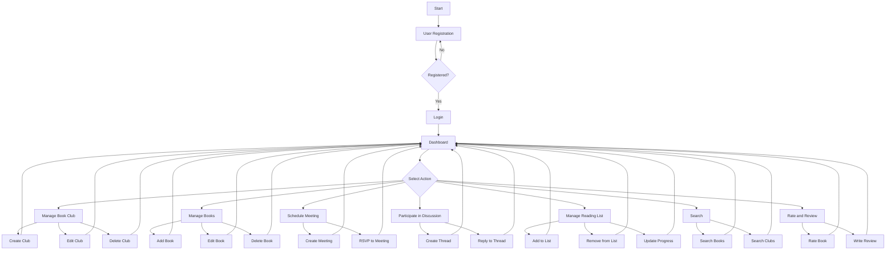
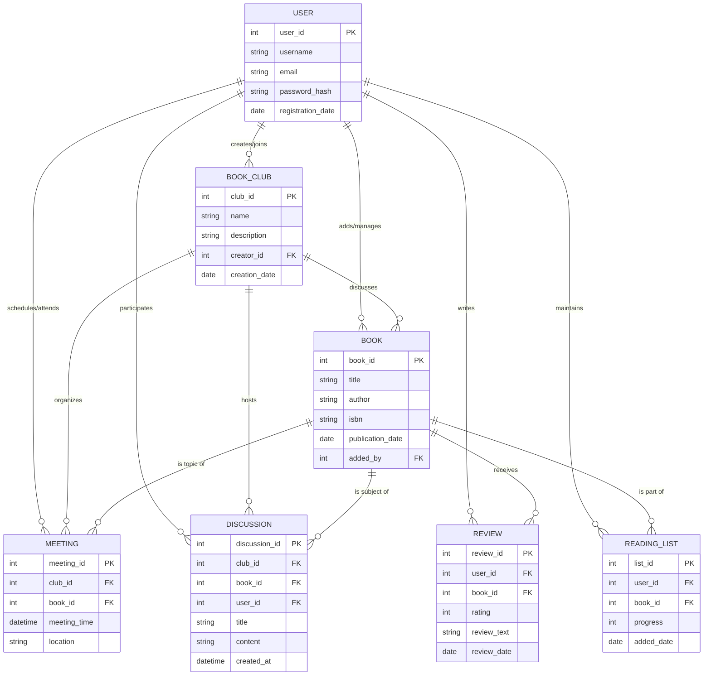

# Case Study: BookBuddy - Online Book Club Management System

## Background

A group of book enthusiasts wants to create an online platform called "BookBuddy" to manage their book club activities.
They need a web application that allows members to organize meetings, discuss books, and keep track of their reading
lists.

## Software Requirements Analysis

**Functional Requirements:**

1. User registration and authentication
2. Create and manage book club profiles
3. Add and manage book information
4. Schedule and RSVP to book club meetings
5. Create and participate in book discussions
6. Maintain personal reading lists
7. Search for books and book clubs
8. Rate and review books

**Non-Functional Requirements:**

1. Performance: The application should load within 3 seconds
2. Scalability: Support up to 10,000 concurrent users
3. Security: Implement HTTPS and secure user data storage
4. Usability: Intuitive interface accessible on desktop and mobile devices
5. Reliability: 99.9% uptime
6. Compatibility: Support major web browsers (Chrome, Firefox, Safari, Edge)

## MoSCoW Analysis

**Must Have:**

- User registration and authentication
- Create and manage book club profiles
- Add and manage book information
- Schedule and RSVP to book club meetings
- Create and participate in book discussions

**Should Have:**

- Maintain personal reading lists
- Rate and review books

**Could Have:**

- Integration with social media platforms
- Book recommendations based on user preferences
- Virtual meeting room for online book discussions

**Won't Have (this time):**

- E-book integration and reading
- Audiobook support
- Multilingual support

## UML Diagrams

### Use Case Diagram

This Use Case Diagram illustrates the main functionalities of the BookBuddy system and how different types of users
interact with it. Here's a breakdown of the diagram:

1. Actors:
    - User: Represents the primary user of the BookBuddy system.
    - Admin: Represents an administrator with additional privileges.
2. Use Cases for Users:
    - Register: Sign up for a new account.
    - Login: Access the system with existing credentials.
    - Manage Profile: Update personal information.
    - Create Book Club: Start a new book club.
    - Join Book Club: Become a member of an existing book club.
    - Manage Book Club: Edit book club details or manage members.
    - Add Book: Enter new book information into the system.
    - Manage Book: Edit or delete book information.
    - Schedule Meeting: Create a new book club meeting.
    - RSVP to Meeting: Respond to meeting invitations.
    - Create Discussion: Start a new discussion thread.
    - Participate in Discussion: Reply to existing discussions.
    - Manage Reading List: Add or remove books from personal reading list.
    - Search Books: Find books in the system.
    - Search Book Clubs: Find book clubs to join.
    - Rate Book: Provide a numerical rating for a book.
    - Review Book: Write a text review for a book.
3. Use Cases for Admins:
    - Manage Users: Create, edit, or delete user accounts.
    - Moderate Content: Review and manage user-generated content.
    - Generate Reports: Create system usage and activity reports.

```mermaid
graph TD
    User((User))
    Admin((Admin))
    User --> Register[Register]
    User --> Login[Login]
    User --> ManageProfile[Manage Profile]
    User --> CreateBookClub[Create Book Club]
    User --> JoinBookClub[Join Book Club]
    User --> ManageBookClub[Manage Book Club]
    User --> AddBook[Add Book]
    User --> ManageBook[Manage Book]
    User --> ScheduleMeeting[Schedule Meeting]
    User --> RSVPMeeting[RSVP to Meeting]
    User --> CreateDiscussion[Create Discussion]
    User --> ParticipateDiscussion[Participate in Discussion]
    User --> ManageReadingList[Manage Reading List]
    User --> SearchBooks[Search Books]
    User --> SearchBookClubs[Search Book Clubs]
    User --> RateBook[Rate Book]
    User --> ReviewBook[Review Book]
    Admin --> ManageUsers[Manage Users]
    Admin --> ModerateContent[Moderate Content]
    Admin --> GenerateReports[Generate Reports]

    subgraph BookBuddy System
        Register
        Login
        ManageProfile
        CreateBookClub
        JoinBookClub
        ManageBookClub
        AddBook
        ManageBook
        ScheduleMeeting
        RSVPMeeting
        CreateDiscussion
        ParticipateDiscussion
        ManageReadingList
        SearchBooks
        SearchBookClubs
        RateBook
        ReviewBook
        ManageUsers
        ModerateContent
        GenerateReports
    end
```



### Process Flow Diagram

This diagram illustrates the main processes and user interactions within the BookBuddy application. It starts with user
registration and login, then branches out to various actions a user can perform, such as managing book clubs, books,
meetings, discussions, reading lists, searching, and reviewing books. Each action is further broken down into specific
tasks, all leading back to the main dashboard.



### Entity-Relationship Diagram

This diagram shows the data structure of the BookBuddy application, depicting the relationships between different
entities:

- USER is the central entity, connected to all other entities as users interact with every aspect of the system.
- BOOK_CLUB is connected to USER (many-to-many relationship as users can create/join multiple clubs), BOOK, MEETING, and
  DISCUSSION.
- BOOK is connected to USER, BOOK_CLUB, MEETING, DISCUSSION, REVIEW, and READING_LIST.
- MEETING is connected to BOOK_CLUB, BOOK, and indirectly to USER.
- DISCUSSION is connected to USER, BOOK_CLUB, and BOOK.
- READING_LIST connects USER and BOOK.
- REVIEW connects USER and BOOK.

Each entity has its attributes listed, including primary keys (PK) and foreign keys (FK) where applicable.



---

## GitHub Feature Branch Workflow

1. Ensure your local main branch is up-to-date

```shell
git checkout main
git pull origin main
```

2. Create and switch to a new feature branch

```text
git checkout -b feature/your-feature-name
```

3. Develop your feature

Make your changes in the feature branch. You can use your preferred code editor or IDE for this step.

4. Stage your changes

```text
git add .
```

5. Commit your changes

```shell
git commit -m "Implement feature: your-feature-name"
```

6. Push your feature branch to the remote repository

```shell
git push -u origin feature/your-feature-name
```

7. Create a Pull Request (Merge Request)

- Go to your repository on GitHub.
- Click on the "Pull requests" tab.
- Click the "New pull request" button.
- Set the base branch to main and the compare branch to feature/your-feature-name.
- Click "Create pull request".
- Add a title and description for your pull request.
- Assign reviewers if necessary.
- Click "Create pull request" to submit it for review.

